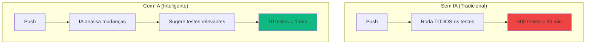
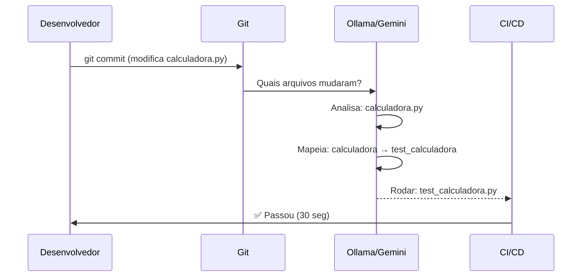
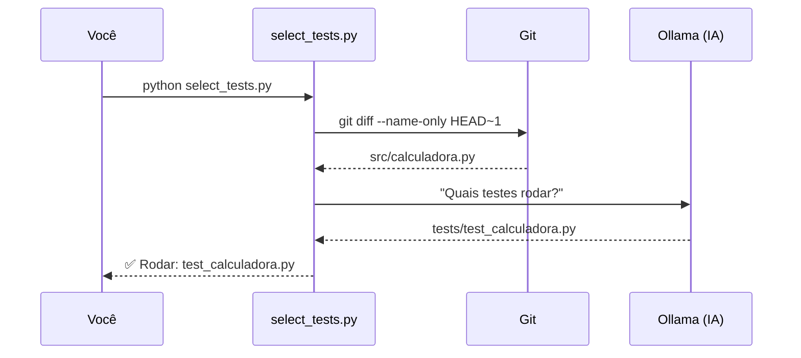

# 🎬 Vídeo 7.1 - Otimização de Testes com IA

## 📋 Informações do Vídeo

| Item | Detalhe |
|------|---------|
| **Duração** | ~15 minutos |
| **Tema** | IA para seleção inteligente de testes |
| **Ferramentas** | Ollama (local) + Gemini API (CI) |
| **Custo** | $0 (100% gratuito) |
| **Pré-requisito** | Python 3.9+, Git |

---

## 🎯 Objetivo

Ensinar como usar **IA gratuita** para analisar código e sugerir quais testes executar, economizando tempo no CI/CD.

---

## 🧠 Arquitetura e Conceito

### O Problema

Em projetos grandes, rodar **todos os testes** a cada commit é lento e caro:

```
Projeto com 500 testes
├── Tempo: 30 minutos por PR
├── Custo: Minutos de CI consumidos
└── Feedback: Desenvolvedor espera muito
```

### A Solução: IA para Seleção Inteligente

A IA analisa **quais arquivos mudaram** e sugere **apenas os testes relacionados**:

```
Mudou: src/calculadora.py
   ↓
IA entende: "Calculadora foi modificada"
   ↓
Sugere: tests/test_calculadora.py
   ↓
Resultado: 5 testes em 30 segundos (em vez de 500 em 30 min)
```

### 📊 Diagrama: Visão Geral



### 📊 Diagrama: Fluxo Detalhado



### Ferramentas Utilizadas

| Ferramenta | Onde Usa | Por quê? |
|------------|----------|----------|
| **Ollama** | Local (desenvolvimento) | IA grátis, roda offline |
| **Gemini API** | CI/CD (GitHub Actions) | API grátis, sem download |

### Por que duas ferramentas?

```mermaid
graph LR
    subgraph "Local"
        A[Ollama] --> B[Modelo 2GB local]
        B --> C[Funciona offline]
    end
    
    subgraph "CI/CD"
        D[Gemini API] --> E[Modelo na nuvem]
        E --> F[Sem download]
    end
    
    style A fill:#000000
    style D fill:#000000
```



- **Ollama no CI** = Baixar 2GB a cada run ❌
- **Gemini no CI** = Chamada HTTP de 1 segundo ✅

---

## 📊 Diagrama: Conceito Simples

```mermaid
graph LR
    A[📝 Código Mudou] --> B[🤖 IA Analisa]
    B --> C[🎯 Sugere Testes]
    C --> D[✅ Roda só o necessário]
    
    style B fill:#000000
```



**Benefício:** Em vez de rodar 100 testes (30 min), roda só 10 relevantes (3 min).

---

## 🛠️ Parte 1: Configurar Ollama (Local)

### Passo 1: Instalar Ollama

**macOS:**
```bash
# Baixar e instalar via Homebrew
brew install ollama

# OU baixar instalador em: https://ollama.com/download/mac
```

**Linux:**
```bash
curl -fsSL https://ollama.com/install.sh | sh
```

**Windows:**
```
Baixar instalador em: https://ollama.com/download/windows
```

### Passo 2: Baixar um modelo leve

```bash
# Modelo pequeno e rápido (~2GB)
ollama pull llama3.2

# Testar se funcionou
ollama run llama3.2 "Olá, tudo bem?"
```

> 💡 **Dica:** O modelo fica salvo. Só precisa baixar uma vez!

### Passo 3: Verificar API rodando

**Mac/Linux:**
```bash
curl http://localhost:11434/api/tags
```

**Windows (PowerShell):**
```powershell
Invoke-RestMethod http://localhost:11434/api/tags
```

**Saída esperada:**
```json
{
  "models": [{"name": "llama3.2:latest"}]
}
```

---

## 🐍 Parte 2: Explorar o Projeto

O projeto já está pronto na pasta `aula07-ia-testes/`.

### Estrutura dos Arquivos

```
aula07-ia-testes/
├── src/
│   ├── calculadora.py      # Funções: somar, subtrair, etc
│   └── usuario.py          # Funções: criar_usuario, validar_email
├── tests/
│   ├── test_calculadora.py # Testes da calculadora
│   └── test_usuario.py     # Testes do usuário
├── select_tests.py         # 🤖 Seletor com Ollama (LOCAL)
├── select_tests_ci.py      # 🤖 Seletor com Gemini (CI)
└── requirements.txt
```

### Passo 4: Entrar no projeto e configurar ambiente Python

```bash
cd aula07-ia-testes
```

**Criar e ativar ambiente virtual:**

**Mac/Linux:**
```bash
python3 -m venv venv
source venv/bin/activate
```

**Windows (PowerShell):**
```powershell
python -m venv venv
venv\Scripts\activate
```

**Instalar dependências:**
```bash
pip install -r requirements.txt
```

> 💡 **Dica:** Quando o ambiente virtual está ativo, você verá `(venv)` no início do terminal. Sempre ative antes de rodar os scripts!

### Passo 5: Rodar os testes (modo tradicional)

```bash
# Roda TODOS os testes
pytest tests/ -v
```

**Saída:**
```
tests/test_calculadora.py::test_somar PASSED
tests/test_calculadora.py::test_subtrair PASSED
tests/test_calculadora.py::test_multiplicar PASSED
tests/test_calculadora.py::test_dividir PASSED
tests/test_calculadora.py::test_dividir_por_zero PASSED
tests/test_usuario.py::test_criar_usuario PASSED
tests/test_usuario.py::test_validar_email_valido PASSED
tests/test_usuario.py::test_validar_email_invalido PASSED

8 passed in 0.05s
```

---

## 🤖 Parte 3: Usar o Seletor com IA

### Passo 6: Inicializar Git e fazer commit

```bash
# Inicializar repositório
git init

# Primeiro commit
git add .
git commit -m "Estrutura inicial do projeto"
```

### Passo 7: Simular uma modificação

**Mac/Linux:**
```bash
# Modificar apenas a calculadora
echo "" >> src/calculadora.py
echo "# Nova feature" >> src/calculadora.py

# Commit da mudança
git add .
git commit -m "Modificar calculadora"
```

**Windows (PowerShell):**
```powershell
# Modificar apenas a calculadora
Add-Content src/calculadora.py "`n# Nova feature"

# Commit da mudança
git add .
git commit -m "Modificar calculadora"
```

### Passo 8: Rodar o seletor com IA

```bash
# Com ambiente virtual ativo (recomendado):
python select_tests.py

# OU sem ambiente virtual:
python3 select_tests.py
```

**Saída esperada:**
```
==================================================
🤖 Seletor de Testes com IA (Ollama)
==================================================

🔍 Analisando arquivos modificados...

📝 Arquivos modificados:
   - src/calculadora.py

🤖 Consultando Ollama...

✅ Testes sugeridos pela IA:
------------------------------
tests/test_calculadora.py
------------------------------

💡 Comando para executar:
   pytest tests/test_calculadora.py -v
```

### Passo 9: Rodar apenas os testes sugeridos

```bash
# Agora roda SÓ o que a IA sugeriu!
pytest tests/test_calculadora.py -v
```

**Resultado:** 5 testes em vez de 8! 🎉

---

## 📊 Diagrama: O que aconteceu



---

## ☁️ Parte 4: Preparar para CI/CD (Gemini API)

### Por que API na nuvem em vez de Ollama no CI?

| Aspecto | Ollama no CI | Gemini API |
|---------|--------------|-----------------|
| Download | 2GB por run ❌ | 0 ✅ |
| Tempo | +10 min ❌ | +2 seg ✅ |
| Custo | Consome minutos | Grátis ✅ |

### Passo 10: Criar conta no Google AI Studio (grátis)

1. Acesse: https://aistudio.google.com/apikey
2. Faça login com sua conta Google
3. Clique em **Create API Key**
4. Copie a chave

> 💡 **Alternativa:** Se preferir usar Groq, acesse https://console.groq.com

### Passo 11: Testar localmente com Gemini

**Mac/Linux:**
```bash
# Ativar ambiente virtual (se não estiver ativo)
source venv/bin/activate

# Configurar a chave
export GEMINI_API_KEY="sua_chave_aqui"

# Rodar versão CI
python select_tests_ci.py

# OU sem ambiente virtual:
GEMINI_API_KEY="sua_chave_aqui" python3 select_tests_ci.py
```

**Windows (PowerShell):**
```powershell
# Ativar ambiente virtual (se não estiver ativo)
venv\Scripts\activate

# Configurar a chave
$env:GEMINI_API_KEY="sua_chave_aqui"

# Rodar versão CI
python select_tests_ci.py
```

**Saída:**
```
==================================================
🤖 Seletor de Testes com IA (Gemini API)
==================================================

🔍 Analisando mudanças...
📝 Modificados: src/calculadora.py

🤖 Consultando Gemini API...

✅ Testes sugeridos:
tests/test_calculadora.py

📄 Salvo em: suggested_tests.txt
```

---

## 🚀 Parte 5: Criar Workflow

> ⚠️ **Esta parte faremos juntos durante a videoaula!**

O workflow será criado em `.github/workflows/ai-tests.yml` e vai:

1. Detectar arquivos modificados
2. Chamar Gemini API para sugerir testes
3. Rodar apenas os testes sugeridos

### Passo 12: Criar Workflow CI/CD

**Mac/Linux:**
```bash
# Criar diretório e arquivo workflow
mkdir -p .github/workflows

cat > .github/workflows/ai-tests.yml << 'EOF'
name: 🤖 AI Test Selection

on:
  push:
    branches: [main]
  pull_request:
    branches: [main]
  workflow_dispatch:

permissions:
  contents: read
  issues: write

jobs:
  smart-tests:
    runs-on: ubuntu-latest
    steps:
      - uses: actions/checkout@v4
        with:
          fetch-depth: 2
      
      - uses: actions/setup-python@v4
        with:
          python-version: '3.11'
      
      - name: 📦 Instalar dependências
        run: |
          cd aula07-ia-testes
          pip install -r requirements.txt
      
      - name: 🤖 Selecionar testes com IA
        env:
          GEMINI_API_KEY: ${{ secrets.GEMINI_API_KEY }}
        run: |
          cd aula07-ia-testes
          python select_tests_ci.py
      
      - name: 🧪 Rodar testes selecionados
        id: tests
        run: |
          cd aula07-ia-testes
          if [ -s suggested_tests.txt ]; then
            pytest $(cat suggested_tests.txt) -v --tb=short 2>&1 | tee test-results.txt
            echo "tests_run=true" >> $GITHUB_OUTPUT
          else
            echo "Nenhum teste para rodar" > test-results.txt
            echo "tests_run=false" >> $GITHUB_OUTPUT
          fi
      
      - name: 📊 Gerar Sumário
        if: always()
        run: |
          cd aula07-ia-testes
          echo "## 🤖 AI Test Selection - Sumário" >> $GITHUB_STEP_SUMMARY
          echo "" >> $GITHUB_STEP_SUMMARY
          echo "### 📋 Testes Selecionados pela IA:" >> $GITHUB_STEP_SUMMARY
          echo '```' >> $GITHUB_STEP_SUMMARY
          cat suggested_tests.txt >> $GITHUB_STEP_SUMMARY
          echo '```' >> $GITHUB_STEP_SUMMARY
          echo "" >> $GITHUB_STEP_SUMMARY
          echo "### 🧪 Resultado dos Testes:" >> $GITHUB_STEP_SUMMARY
          echo '```' >> $GITHUB_STEP_SUMMARY
          cat test-results.txt >> $GITHUB_STEP_SUMMARY
          echo '```' >> $GITHUB_STEP_SUMMARY
EOF
```

**Windows (PowerShell):**
```powershell
# Criar diretório
New-Item -ItemType Directory -Force -Path ".github/workflows"

# Criar arquivo (copiar conteúdo YAML acima manualmente)
notepad .github/workflows/ai-tests.yml
```

> 💡 **Lembre-se:** Adicione `GEMINI_API_KEY` nos secrets do repositório!
> 
> **Alternativa:** Se preferir usar Groq, troque para `GROQ_API_KEY` e ajuste `USE_GEMINI = False` no script.

---

## 📊 Diagrama: Fluxo Completo

```mermaid
graph TB
    subgraph "💻 Local (Desenvolvimento)"
        A[Código] --> B[select_tests.py]
        B --> C[Ollama Local]
        C --> D[Sugestão de Testes]
    end
    
    subgraph "☁️ CI (GitHub Actions)"
        E[Push/PR] --> F[select_tests_ci.py]
        F --> G[Gemini API]
        G --> H[pytest]
    end
    
    style C fill:#000000
    style G fill:#000000
```



---

## ✅ Checklist de Aprendizado

Após este vídeo, você sabe:

- [ ] Instalar e usar Ollama localmente
- [ ] Fazer chamadas HTTP para LLMs
- [ ] Integrar IA com Git (arquivos modificados)
- [ ] Usar Gemini API (grátis) no CI
- [ ] Criar GitHub Action com IA

---

## 🎯 Resumo

| Ambiente | Ferramenta | Custo | Velocidade |
|----------|------------|-------|------------|
| **Local** | Ollama | Grátis | ~2s |
| **CI/CD** | Gemini API | Grátis | ~1s |

### Economia Real

```
Sem IA:  100 testes × 30 min = 30 min por PR
Com IA:  10 testes × 3 min = 3 min por PR

Economia: 90% do tempo! 🚀
```

---

## 🌍 Aplicação no Mundo Real

### O que fizemos no curso (demonstração):
```
calculadora.py modificado → IA sugere test_calculadora.py
```

### Como funciona em produção:
```
src/payment/checkout.py modificado → IA sugere:
  - tests/unit/test_checkout.py
  - tests/integration/test_payment_flow.py
  - tests/e2e/test_purchase.py
```

### Exemplos por Indústria

| Empresa | Cenário Real |
|---------|--------------|
| **E-commerce** | Mudou código de carrinho → Roda só testes de carrinho (não de login, perfil, etc.) |
| **Fintech** | Mudou cálculo de juros → Roda testes financeiros (não de UI) |
| **SaaS** | Mudou API de usuários → Roda testes de API (não de billing) |
| **Streaming** | Mudou player de vídeo → Roda testes de player (não de recomendação) |

### Ferramentas Usadas em Produção

| Curso | Produção |
|-------|----------|
| `select_tests.py` (script local) | Bazel, Buck, Nx (build systems inteligentes) |
| Ollama (LLM local) | Modelos internos fine-tuned |
| Gemini API (grátis) | GPT-4, Claude, ou APIs enterprise |
| GitHub Actions | Jenkins, CircleCI, GitLab CI, Azure DevOps |
| 100 testes | 50.000+ testes em monorepos grandes |

### Empresas que Usam Técnicas Similares

- **Google**: Usa ML para prever quais testes vão falhar
- **Meta**: Test Impact Analysis em monorepo gigante
- **Netflix**: Seleção inteligente de testes por microserviço
- **Microsoft**: Predictive Test Selection no Azure DevOps

### Economia Real

```
Empresa com 50.000 testes:
├── Sem IA: 4 horas por PR (roda tudo)
├── Com IA: 15 minutos por PR (roda ~500 relevantes)
└── Economia: 93% do tempo + custo de CI
```

---

## 🔗 Links Úteis

- **Ollama**: https://ollama.com
- **Gemini Console**: https://aistudio.google.com
- **Groq Console** (alternativa): https://console.groq.com

---

## ⏭️ Próximo Vídeo

**Vídeo 7.2**: Detecção de Falhas com IA
- Analisar logs automaticamente
- Detectar padrões de erro
- Alertas inteligentes

---

**FIM DO VÍDEO 7.1** ✅
