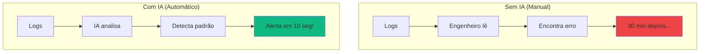
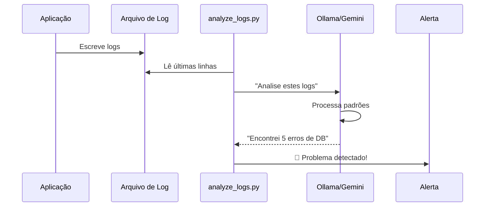

# 🎬 Vídeo 7.2 - Detecção de Falhas com IA

## 📋 Informações do Vídeo

| Item | Detalhe |
|------|---------|
| **Duração** | ~15 minutos |
| **Tema** | AIOps - Análise de logs com IA |
| **Ferramentas** | Ollama (local) + Gemini API (CI) |
| **Custo** | $0 (100% gratuito) |
| **Pré-requisito** | Vídeo 7.1 concluído |

---

## 🎯 Objetivo

Ensinar como usar **IA para analisar logs** automaticamente, detectando problemas e padrões de erro antes que causem incidentes maiores.

---

## 🧠 Arquitetura e Conceito

### O que é AIOps?

**AIOps** = Artificial Intelligence + Operations

É usar IA para automatizar tarefas de operações como:
- Análise de logs
- Detecção de anomalias
- Predição de falhas
- Resposta a incidentes

### O Problema

```
Cenário tradicional:
├── Aplicação gera 10.000 linhas de log por hora
├── Engenheiro precisa ler manualmente
├── Demora para encontrar o problema
└── Incidente já causou impacto quando descoberto
```

### A Solução: IA Analisa os Logs

```
Com IA:
├── Logs são enviados para IA
├── IA identifica padrões de erro em segundos
├── Alerta automático: "Database com problemas!"
└── Time age ANTES do incidente escalar
```

### 📊 Diagrama: Visão Geral



### 📊 Diagrama: Fluxo de Análise



### Ferramentas Utilizadas

| Ferramenta | Onde Usa | Por quê? |
|------------|----------|----------|
| **Ollama** | Local (desenvolvimento) | IA grátis, roda offline |
| **Gemini API** | CI/CD (GitHub Actions) | API grátis, resposta rápida |

---

## 🛠️ Parte 1: Explorar o Projeto

O projeto já está pronto na pasta `aula07-ia-logs/`.

### Estrutura dos Arquivos

```
aula07-ia-logs/
├── logs/
│   └── app.log              # Logs de exemplo (com erros!)
├── analyze_logs.py          # 🤖 Analisador com Ollama (LOCAL)
├── analyze_logs_ci.py       # 🤖 Analisador com Gemini (CI)
├── requirements.txt
└── README.md
```

### Passo 1: Entrar no projeto e configurar ambiente Python

```bash
cd aula07-ia-logs
```

**Criar e ativar ambiente virtual:**

**Mac/Linux:**
```bash
python3 -m venv venv
source venv/bin/activate
```

**Windows (PowerShell):**
```powershell
python -m venv venv
venv\Scripts\activate
```

**Instalar dependências:**
```bash
pip install -r requirements.txt
```

> 💡 **Dica:** Quando o ambiente virtual está ativo, você verá `(venv)` no início do terminal.

### Passo 2: Ver os logs de exemplo

**Mac/Linux:**
```bash
cat logs/app.log
```

**Windows (PowerShell):**
```powershell
Get-Content logs/app.log
```

**Saída (logs com problemas):**
```
2024-01-17 10:00:01 [INFO] Application started successfully
2024-01-17 10:00:02 [INFO] Connected to database
...
2024-01-17 10:00:30 [ERROR] Database connection timeout after 30s
2024-01-17 10:00:31 [ERROR] Failed to process request: Connection refused
2024-01-17 10:00:32 [ERROR] Database connection timeout after 30s
...
2024-01-17 10:00:40 [CRITICAL] Database connection failed after 3 retries
2024-01-17 10:00:50 [WARN] Memory usage high: 85%
2024-01-17 10:01:00 [ERROR] OutOfMemoryError: Java heap space
2024-01-17 10:01:01 [CRITICAL] Application crash: restarting service
```

> 💡 Note os padrões: múltiplos erros de database, memory crescendo, crash!

---

## 🤖 Parte 2: Analisar com IA Local (Ollama)

### Passo 3: Verificar Ollama rodando

```bash
# Em outro terminal, se não estiver rodando:
ollama serve
```

### Passo 4: Rodar o analisador

```bash
python analyze_logs.py
```

**Saída esperada:**
```
============================================================
🤖 Analisador de Logs com IA (Ollama)
============================================================

📂 Lendo arquivo de logs...

📊 Estatísticas:
   Total de linhas: 25
   🟢 INFO: 10
   🟡 WARN: 4
   🔴 ERROR: 8
   💀 CRITICAL: 3

🤖 Analisando com IA...
------------------------------------------------------------

📋 ANÁLISE DA IA:
============================================================
## 1. ERROS CRÍTICOS

🔴 **Database Connection Failed** - O banco de dados ficou 
inacessível após 3 tentativas de reconexão.

🔴 **OutOfMemoryError** - Aplicação ficou sem memória heap,
causando crash.

## 2. PADRÕES PREOCUPANTES

🟡 Sequência de timeouts de database (4 ocorrências em 10s)
indica problema de conectividade ou sobrecarga do DB.

🟡 Memory usage crescente (85% → 88% → crash) indica
possível memory leak.

## 3. CAUSA RAIZ PROVÁVEL

O database provavelmente ficou sobrecarregado (slow query 
de 2.5s detectada), causando timeouts. A aplicação tentou
reconectar várias vezes, consumindo memória, até crashar.

## 4. RECOMENDAÇÕES

1. Verificar conexões do database e pool de conexões
2. Otimizar a query lenta detectada
3. Aumentar heap size ou investigar memory leak
4. Configurar circuit breaker para falhas de DB
============================================================
```

---

## 📊 Diagrama: O que aconteceu

```mermaid
graph LR
    A[app.log] --> B[analyze_logs.py]
    B --> C[Conta erros]
    B --> D[Envia para Ollama]
    D --> E[IA analisa padrões]
    E --> F[Retorna diagnóstico]
    
    style D fill:#000000
```



---

## ☁️ Parte 3: Preparar para CI/CD (Gemini API)

### Por que API na nuvem no CI?

| Aspecto | Ollama no CI | Gemini API |
|---------|--------------|-----------------|
| Download | 2GB por run ❌ | 0 ✅ |
| Tempo | +10 min ❌ | +2 seg ✅ |
| Resposta | Texto livre | JSON estruturado ✅ |

### Passo 5: Testar com Gemini

**Mac/Linux:**
```bash
# Ativar ambiente virtual (se não estiver ativo)
source venv/bin/activate

# Configurar chave (mesma do vídeo 7.1)
export GEMINI_API_KEY="sua_chave_aqui"

# Rodar versão CI
python analyze_logs_ci.py

# OU sem ambiente virtual:
GEMINI_API_KEY="sua_chave_aqui" python3 analyze_logs_ci.py
```

**Windows (PowerShell):**
```powershell
# Ativar ambiente virtual (se não estiver ativo)
venv\Scripts\activate

# Configurar chave (mesma do vídeo 7.1)
$env:GEMINI_API_KEY="sua_chave_aqui"

# Rodar versão CI
python analyze_logs_ci.py
```

**Saída:**
```
============================================================
🤖 Analisador de Logs com IA (Gemini API)
============================================================

📂 Lendo logs...
📊 Encontrados: 8 erros, 3 críticos

🤖 Consultando Gemini API...

📋 ANÁLISE:
{
  "status": "critical",
  "errors_found": 8,
  "main_issue": "Database connection failures causing application crash",
  "recommendation": "Check database connectivity and increase connection pool"
}

📄 Salvo em: log-analysis.json

🔴 Status: CRÍTICO - Ação necessária!
```

### Diferença: Texto vs JSON

| Ollama (Local) | Gemini (CI) |
|----------------|-------------|
| Análise em texto livre | JSON estruturado |
| Bom para humanos lerem | Bom para automação |
| Detalhado | Objetivo |

---

## 🚀 Parte 4: Criar Workflow (FAZER JUNTOS NA AULA)

> ⚠️ **Esta parte faremos juntos durante a videoaula!**

O workflow será criado em `.github/workflows/ai-log-analysis.yml` e vai:

1. Rodar periodicamente (cron) ou em push
2. Analisar logs com Gemini API
3. Criar issue se encontrar problemas críticos

### Passo 6: Criar Workflow CI/CD

**Mac/Linux:**
```bash
# Criar diretório e arquivo workflow
mkdir -p .github/workflows

cat > .github/workflows/ai-log-analysis.yml << 'EOF'
name: 🤖 AI Log Analysis

on:
  schedule:
    - cron: '0 */6 * * *'
  workflow_dispatch:

permissions:
  contents: read
  issues: write

jobs:
  analyze:
    runs-on: ubuntu-latest
    steps:
      - uses: actions/checkout@v4
      
      - uses: actions/setup-python@v4
        with:
          python-version: '3.11'
      
      - run: pip install requests
      
      - name: 🤖 Analisar logs
        env:
          GEMINI_API_KEY: ${{ secrets.GEMINI_API_KEY }}
        run: |
          cd aula07-ia-logs
          python analyze_logs_ci.py
      
      - name: 📊 Gerar Sumário
        if: always()
        run: |
          cd aula07-ia-logs
          echo "## 🤖 AI Log Analysis - Sumário" >> $GITHUB_STEP_SUMMARY
          echo "" >> $GITHUB_STEP_SUMMARY
          echo "### 📋 Resultado da Análise:" >> $GITHUB_STEP_SUMMARY
          echo '```json' >> $GITHUB_STEP_SUMMARY
          cat log-analysis.json >> $GITHUB_STEP_SUMMARY
          echo '```' >> $GITHUB_STEP_SUMMARY
      
      - name: 🚨 Criar issue se crítico
        if: always()
        uses: actions/github-script@v7
        with:
          script: |
            const fs = require('fs');
            try {
              const analysis = JSON.parse(fs.readFileSync('aula07-ia-logs/log-analysis.json', 'utf8'));
              if (analysis.status === 'critical') {
                await github.rest.issues.create({
                  owner: context.repo.owner,
                  repo: context.repo.repo,
                  title: '🚨 Problema crítico detectado nos logs',
                  body: `**Status:** ${analysis.status}\n**Erros:** ${analysis.errors_found}\n**Problema:** ${analysis.main_issue}\n**Recomendação:** ${analysis.recommendation}`,
                  labels: ['bug', 'critical']
                });
                console.log('Issue criada com sucesso!');
              } else {
                console.log('Status não é crítico, issue não criada.');
              }
            } catch (e) {
              console.log('Arquivo não encontrado ou erro:', e.message);
            }
EOF
```

**Windows (PowerShell):**
```powershell
# Criar diretório
New-Item -ItemType Directory -Force -Path ".github/workflows"

# Criar arquivo (copiar conteúdo YAML acima manualmente)
notepad .github/workflows/ai-log-analysis.yml
```

> 💡 **Lembre-se:** Adicione `GEMINI_API_KEY` nos secrets do repositório!

---

## 📊 Diagrama: Fluxo Completo

```mermaid
graph TB
    subgraph "💻 Local (Desenvolvimento)"
        A[Logs] --> B[analyze_logs.py]
        B --> C[Ollama]
        C --> D[Análise detalhada]
    end
    
    subgraph "☁️ CI (GitHub Actions)"
        E[Schedule/Push] --> F[analyze_logs_ci.py]
        F --> G[Gemini API]
        G --> H{Status?}
        H -->|Critical| I[Criar Issue]
        H -->|OK| J[Passar]
    end
    
    style C fill:#000000
    style G fill:#000000
    style I fill:#000000
```



---

## ✅ Checklist de Aprendizado

Após este vídeo, você sabe:

- [ ] O que é AIOps (IA + Operações)
- [ ] Analisar logs com IA local (Ollama)
- [ ] Detectar padrões de erro automaticamente
- [ ] Usar Gemini API para análise estruturada (JSON)
- [ ] Integrar análise de logs no CI/CD

---

## 🎯 Resumo

| Aspecto | Sem IA | Com IA |
|---------|--------|--------|
| **Tempo** | 30 min lendo logs | 10 segundos |
| **Precisão** | Depende do humano | Consistente |
| **Escala** | Não escala | 10.000 linhas = mesmo tempo |
| **Custo** | Hora do engenheiro | $0 (Ollama/Gemini) |

### Benefício Real

```
Antes: Incidente → 2h para descobrir causa
Depois: IA detecta → Alerta em 10 segundos

MTTR reduzido em 90%! 🚀
```

---

## 🔗 Links Úteis

- **Ollama**: https://ollama.com
- **Gemini Console**: https://aistudio.google.com
- **Groq Console** (alternativa): https://console.groq.com
- **AIOps (Gartner)**: https://www.gartner.com/en/information-technology/glossary/aiops

---

## ⏭️ Próximo Vídeo

**Vídeo 7.3**: Automação de Resposta a Incidentes
- Criar runbooks automatizados
- Resposta automática a alertas
- GitHub Actions como orquestrador

---

**FIM DO VÍDEO 7.2** ✅
