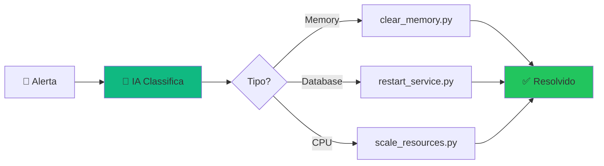
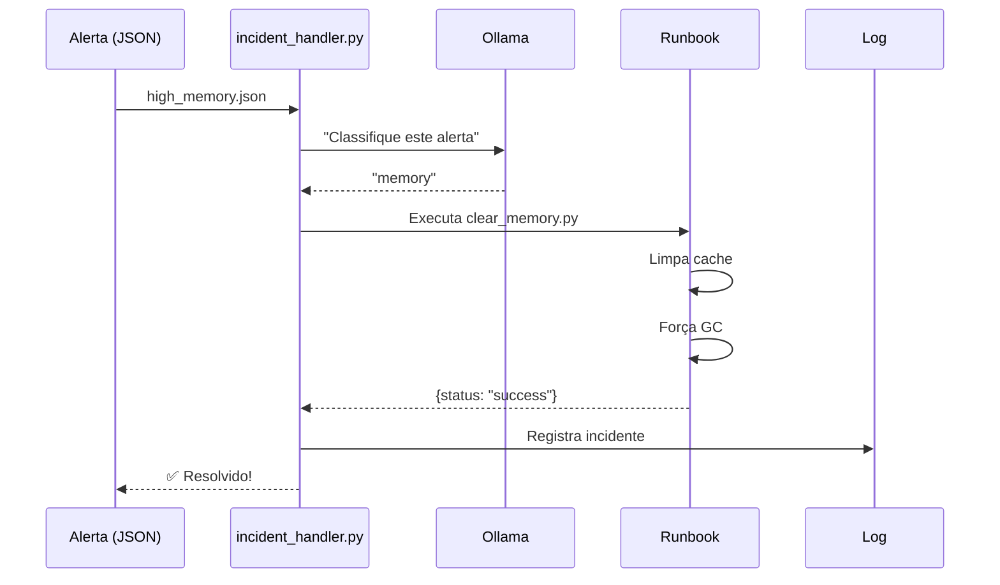
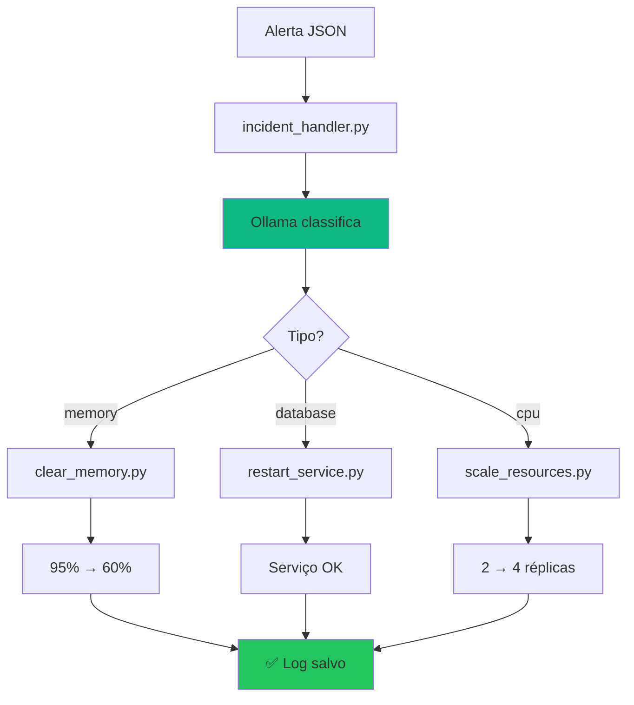
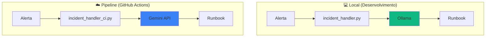
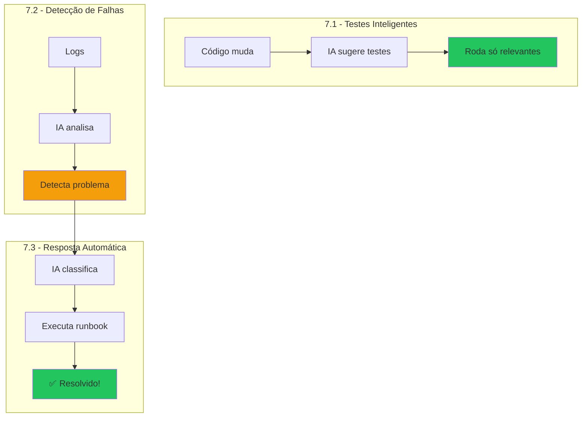

# 🎬 Vídeo 7.3 - Automação de Resposta a Incidentes

## 📋 Informações do Vídeo

| Item | Detalhe |
|------|---------|
| **Duração** | ~15 minutos |
| **Tema** | Runbooks automatizados com IA |
| **Ferramentas** | Ollama (local) + GitHub Actions |
| **Custo** | $0 (100% gratuito) |
| **Pré-requisito** | Vídeos 7.1 e 7.2 concluídos |

---

## 🎯 Objetivo

Ensinar como criar **runbooks automatizados** que respondem a incidentes automaticamente, usando IA para classificar o problema e selecionar a ação correta.

---

## 🧠 Arquitetura e Conceito

### O que são Runbooks?

**Runbooks** são procedimentos documentados que descrevem como resolver problemas específicos. Com automação, eles **executam sozinhos**!

### O Problema

```
Cenário tradicional (manual):
├── 02:00 AM - Alerta dispara
├── 02:05 AM - Engenheiro acorda
├── 02:15 AM - Engenheiro investiga
├── 02:30 AM - Engenheiro executa fix
├── 02:35 AM - Problema resolvido
└── Total: 35 minutos de downtime 😰
```

### A Solução: Resposta Automatizada

```
Com automação:
├── 02:00 AM - Alerta dispara
├── 02:00 AM - IA classifica: "problema de memória"
├── 02:00 AM - Runbook executa: limpar cache
├── 02:01 AM - Problema resolvido
├── 02:01 AM - Engenheiro notificado (pode dormir!)
└── Total: 1 minuto de downtime 🎉
```

### 📊 Diagrama: Visão Geral



### 📊 Diagrama: Fluxo Detalhado



### Mapeamento: Alerta → Runbook

| Tipo de Alerta | Runbook | Ação |
|----------------|---------|------|
| `high_memory` | `clear_memory.py` | Limpa cache, força GC |
| `database_down` | `restart_service.py` | Reinicia serviço |
| `high_cpu` | `scale_resources.py` | Escala réplicas |

---

## 🛠️ Parte 1: Explorar o Projeto

O projeto já está pronto na pasta `aula07-ia-incident/`.

### Estrutura dos Arquivos

```
aula07-ia-incident/
├── alerts/
│   ├── high_memory.json     # 🚨 Alerta: memória 95%
│   ├── database_down.json   # 🚨 Alerta: DB fora
│   └── high_cpu.json        # 🚨 Alerta: CPU 90%
├── runbooks/
│   ├── clear_memory.py      # 📋 Limpar memória
│   ├── restart_service.py   # 📋 Reiniciar serviço
│   └── scale_resources.py   # 📋 Escalar recursos
├── logs/
│   └── incidents.log        # 📝 Histórico (criado automaticamente)
├── incident_handler.py      # 🤖 Orquestrador LOCAL (Ollama)
├── incident_handler_ci.py   # 🤖 Orquestrador CI (Gemini API)
└── requirements.txt
```

### Duas Versões: Local vs CI

| Aspecto | Local | Pipeline (CI) |
|---------|-------|---------------|
| **Script** | `incident_handler.py` | `incident_handler_ci.py` |
| **IA** | Ollama (localhost) | Gemini API (cloud) |
| **Quando usa** | Desenvolvimento | GitHub Actions |
| **Requisito** | Ollama rodando | `GEMINI_API_KEY` secret |

### Passo 1: Entrar no projeto e configurar ambiente Python

```bash
cd aula07-ia-incident
```

**Criar e ativar ambiente virtual:**

**Mac/Linux:**
```bash
python3 -m venv venv
source venv/bin/activate
```

**Windows (PowerShell):**
```powershell
python -m venv venv
venv\Scripts\activate
```

**Instalar dependências:**
```bash
pip install -r requirements.txt
```

> 💡 **Dica:** Quando o ambiente virtual está ativo, você verá `(venv)` no início do terminal.

### Passo 2: Ver um alerta de exemplo

**Mac/Linux:**
```bash
cat alerts/high_memory.json
```

**Windows (PowerShell):**
```powershell
Get-Content alerts/high_memory.json
```

**Saída:**
```json
{
  "alert_id": "alert-001",
  "timestamp": "2024-01-17T10:00:00Z",
  "severity": "critical",
  "type": "high_memory",
  "message": "Memory usage at 95% - OutOfMemoryError imminent",
  "metrics": {
    "memory_percent": 95,
    "memory_used_gb": 7.6,
    "memory_total_gb": 8.0
  }
}
```

---

## 🤖 Parte 2: Executar Resposta Automática

### Passo 3: Testar com alerta de memória

```bash
python incident_handler.py alerts/high_memory.json
```

**Saída (visual e prática!):**
```
============================================================
🤖 ORQUESTRADOR DE RESPOSTA A INCIDENTES
============================================================

📂 Carregando alerta: alerts/high_memory.json

🚨 ALERTA RECEBIDO:
   ID: alert-001
   Severidade: CRITICAL
   Mensagem: Memory usage at 95% - OutOfMemoryError imminent

🤖 Classificando incidente com IA...
   ✓ Tipo identificado: MEMORY
   ✓ Runbook selecionado: runbooks.clear_memory

⚡ Executando runbook...

==================================================
📋 RUNBOOK: Clear Memory
==================================================

⏳ Passo 1: Coletando métricas...
   ✓ Memória atual: 95%
   ✓ Processos identificados: 12

⏳ Passo 2: Limpando cache da aplicação...
   ✓ Cache L1 limpo: 500MB liberados
   ✓ Cache L2 limpo: 1.2GB liberados

⏳ Passo 3: Executando garbage collection...
   ✓ GC executado
   ✓ Objetos coletados: 15,432
   ✓ Memória recuperada: 800MB

⏳ Passo 4: Verificando resultado...
   ✓ Memória após limpeza: 60%
   ✓ Status: HEALTHY

==================================================
✅ MEMÓRIA REDUZIDA: 95% → 60%
==================================================

📝 Log salvo em: logs/incidents.log

============================================================
📊 RESUMO DA RESPOSTA
============================================================
   Alerta: alert-001
   Tipo: memory
   Runbook: clear_memory
   Status: SUCCESS
   Duração: 4s
============================================================

✅ INCIDENTE RESOLVIDO AUTOMATICAMENTE!
```

### Passo 4: Testar com alerta de database

```bash
python incident_handler.py alerts/database_down.json
```

**Saída:**
```
🚨 ALERTA RECEBIDO:
   ID: alert-002
   Severidade: CRITICAL
   Mensagem: Database connection failed after 3 retries

🤖 Classificando incidente com IA...
   ✓ Tipo identificado: DATABASE
   ✓ Runbook selecionado: runbooks.restart_service

⚡ Executando runbook...

==================================================
📋 RUNBOOK: Restart Service
==================================================

⏳ Passo 1: Verificando status atual...
   ✓ Serviço identificado: app-service
   ✓ Status: UNHEALTHY

⏳ Passo 2: Parando serviço...
   ✓ Enviando SIGTERM...
   ✓ Aguardando graceful shutdown...
   ✓ Serviço parado

⏳ Passo 3: Limpando recursos...
   ✓ Conexões de DB fechadas
   ✓ Cache limpo

⏳ Passo 4: Reiniciando serviço...
   ✓ Iniciando novo processo...
   ✓ Health check: OK
   ✓ Serviço reiniciado com sucesso!

==================================================
✅ RUNBOOK CONCLUÍDO COM SUCESSO
==================================================

✅ INCIDENTE RESOLVIDO AUTOMATICAMENTE!
```

### Passo 5: Testar com alerta de CPU

```bash
python incident_handler.py alerts/high_cpu.json
```

**Saída:**
```
🤖 Classificando incidente com IA...
   ✓ Tipo identificado: CPU
   ✓ Runbook selecionado: runbooks.scale_resources

==================================================
📋 RUNBOOK: Scale Resources
==================================================

⏳ Passo 1: Analisando carga atual...
   ✓ CPU atual: 90%
   ✓ Réplicas atuais: 2

⏳ Passo 2: Calculando escala necessária...
   ✓ Réplicas recomendadas: 4

⏳ Passo 3: Escalando recursos...
   ✓ Criando 2 novas réplicas...
   ✓ Aguardando pods ficarem Ready...
   ✓ Load balancer atualizado

⏳ Passo 4: Verificando resultado...
   ✓ Réplicas ativas: 4
   ✓ CPU após escala: 45%

==================================================
✅ ESCALADO: 2 → 4 réplicas | CPU: 90% → 45%
==================================================

✅ INCIDENTE RESOLVIDO AUTOMATICAMENTE!
```

---

## 📊 Diagrama: O que aconteceu



---

## 📝 Parte 3: Ver Histórico de Incidentes

### Passo 6: Verificar log de incidentes

**Mac/Linux:**
```bash
cat logs/incidents.log
```

**Windows (PowerShell):**
```powershell
Get-Content logs/incidents.log
```

**Saída:**
```json
{"timestamp": "2024-01-17T10:00:00", "alert_id": "alert-001", "incident_type": "memory", "runbook_executed": "clear_memory", "status": "success", "actions": ["Cleared application cache", "Forced garbage collection", "Verified memory levels"]}
{"timestamp": "2024-01-17T10:05:00", "alert_id": "alert-002", "incident_type": "database", "runbook_executed": "restart_service", "status": "success", "actions": ["Stopped service gracefully", "Cleared connections", "Restarted service", "Verified health check"]}
```

> 💡 Este log pode ser usado para métricas, dashboards e análise de tendências!

---

## ☁️ Parte 4: Testar Versão CI (Gemini API)

### Por que API na nuvem no CI?

| Aspecto | Ollama no CI | Gemini/Groq API |
|---------|--------------|-----------------|
| Download | 2GB por run ❌ | 0 ✅ |
| Tempo | +10 min ❌ | +2 seg ✅ |

### Passo 7: Testar com Gemini

**Mac/Linux:**
```bash
# Ativar ambiente virtual (se não estiver ativo)
source venv/bin/activate

# Configurar chave (mesma do vídeo 7.1 e 7.2)
export GEMINI_API_KEY="sua_chave_aqui"

# Rodar versão CI
python incident_handler_ci.py alerts/high_memory.json

# OU sem ambiente virtual:
GEMINI_API_KEY="sua_chave_aqui" python3 incident_handler_ci.py alerts/high_memory.json
```

**Windows (PowerShell):**
```powershell
# Ativar ambiente virtual (se não estiver ativo)
venv\Scripts\activate

# Configurar chave (mesma do vídeo 7.1 e 7.2)
$env:GEMINI_API_KEY="sua_chave_aqui"

# Rodar versão CI
python incident_handler_ci.py alerts/high_memory.json
```

**Saída:**
```
============================================================
🤖 ORQUESTRADOR DE INCIDENTES (CI/CD - Gemini API)
============================================================

📂 Carregando: alerts/high_memory.json

🚨 ALERTA:
   ID: alert-001
   Severidade: CRITICAL
   Mensagem: Memory usage at 95% - OutOfMemoryError imminent

🤖 Classificando com Gemini API...
   ✓ Tipo: MEMORY
   ✓ Runbook: runbooks.clear_memory

⚡ Executando runbook...
[... mesma execução do runbook ...]

📝 Log salvo em: logs/incidents.log
📄 Resultado salvo em: incident-result.json

✅ INCIDENTE RESOLVIDO!
```

### Diagrama: Local vs CI



---

## 🚀 Parte 5: Criar Workflow (FAZER JUNTOS NA AULA)

> ⚠️ **Esta parte faremos juntos durante a videoaula!**

O workflow vai integrar **detecção (7.2) + resposta (7.3)**:

1. Analisar logs com IA
2. Se encontrar problema crítico → executar runbook
3. Criar issue no GitHub com resultado

### Passo 8: Criar Workflow CI/CD

**Mac/Linux:**
```bash
# Criar diretório e arquivo workflow
mkdir -p .github/workflows

cat > .github/workflows/ai-incident-response.yml << 'EOF'
name: 🤖 AI Incident Response

on:
  workflow_dispatch:
    inputs:
      alert_file:
        description: 'Arquivo de alerta'
        required: true
        default: 'alerts/high_memory.json'

permissions:
  contents: read
  issues: write

jobs:
  respond:
    runs-on: ubuntu-latest
    steps:
      - uses: actions/checkout@v4
      
      - uses: actions/setup-python@v4
        with:
          python-version: '3.11'
      
      - run: pip install requests
      
      - name: 🤖 Executar resposta automática
        env:
          GEMINI_API_KEY: ${{ secrets.GEMINI_API_KEY }}
        run: |
          cd aula07-ia-incident
          python incident_handler_ci.py ${{ inputs.alert_file }}
      
      - name: 📊 Gerar Sumário
        if: always()
        run: |
          cd aula07-ia-incident
          echo "## 🤖 AI Incident Response - Sumário" >> $GITHUB_STEP_SUMMARY
          echo "" >> $GITHUB_STEP_SUMMARY
          echo "### 🚨 Alerta Processado:" >> $GITHUB_STEP_SUMMARY
          echo '```json' >> $GITHUB_STEP_SUMMARY
          cat ${{ inputs.alert_file }} >> $GITHUB_STEP_SUMMARY
          echo '```' >> $GITHUB_STEP_SUMMARY
          echo "" >> $GITHUB_STEP_SUMMARY
          echo "### 📋 Resultado do Incidente:" >> $GITHUB_STEP_SUMMARY
          echo '```json' >> $GITHUB_STEP_SUMMARY
          cat incident-result.json >> $GITHUB_STEP_SUMMARY
          echo '```' >> $GITHUB_STEP_SUMMARY
          echo "" >> $GITHUB_STEP_SUMMARY
          echo "### 📜 Histórico:" >> $GITHUB_STEP_SUMMARY
          echo '```' >> $GITHUB_STEP_SUMMARY
          tail -5 logs/incidents.log >> $GITHUB_STEP_SUMMARY
          echo '```' >> $GITHUB_STEP_SUMMARY
      
      - name: 📝 Criar issue com resultado
        if: always()
        uses: actions/github-script@v7
        with:
          script: |
            const fs = require('fs');
            const result = JSON.parse(fs.readFileSync('aula07-ia-incident/incident-result.json', 'utf8'));
            github.rest.issues.create({
              owner: context.repo.owner,
              repo: context.repo.repo,
              title: `🤖 Incidente ${result.status}: ${result.incident_type}`,
              body: `**Alerta:** ${result.alert_id}\n**Runbook:** ${result.runbook_executed}\n**Status:** ${result.status}`
            })
EOF
```

**Windows (PowerShell):**
```powershell
# Criar diretório
New-Item -ItemType Directory -Force -Path ".github/workflows"

# Criar arquivo (copiar conteúdo YAML acima manualmente)
notepad .github/workflows/ai-incident-response.yml
```

> 💡 **Importante:** No CI usamos `incident_handler_ci.py` (Gemini), não a versão local!
>
> **Alternativa:** Se preferir usar Groq, troque para `GROQ_API_KEY` e ajuste `USE_GEMINI = False` no script.

---

## 📊 Diagrama: Fluxo Completo da Aula 07



---

## ✅ Checklist de Aprendizado

Após este vídeo, você sabe:

- [ ] O que são Runbooks e por que automatizá-los
- [ ] Classificar incidentes com IA
- [ ] Criar runbooks em Python
- [ ] Orquestrar resposta automática
- [ ] Integrar detecção + resposta no CI/CD

---

## 🎯 Resumo da Aula 07

| Vídeo | Tema | Ferramenta | Resultado |
|-------|------|------------|-----------|
| **7.1** | Testes | Ollama/Groq | 90% menos testes |
| **7.2** | Detecção | Ollama/Groq | Problemas em 10s |
| **7.3** | Resposta | Ollama + Runbooks | MTTR: 35min → 1min |

### Benefício Real

```
Antes (manual):
├── Detecção: 10 min
├── Investigação: 15 min
├── Correção: 10 min
└── Total: 35 minutos

Depois (automatizado):
├── Detecção: 10 seg
├── Classificação: 1 seg
├── Runbook: 30 seg
└── Total: ~1 minuto

Redução de 97% no MTTR! 🚀
```

---

## 🔗 Links Úteis

- **Ollama**: https://ollama.com
- **Runbook Automation**: https://www.pagerduty.com/resources/learn/what-is-a-runbook/
- **Incident Response**: https://sre.google/sre-book/managing-incidents/

---

## 🎉 Parabéns!

Você completou a **Aula 07 - IA e Automação**!

Agora você sabe:
1. ✅ Usar IA para otimizar testes
2. ✅ Detectar falhas automaticamente
3. ✅ Responder a incidentes sem intervenção humana

**Próximos passos:**
- Aplicar em projetos reais
- Explorar mais modelos no Ollama
- Criar seus próprios runbooks

---

**FIM DO VÍDEO 7.3** ✅

**FIM DA AULA 07** 🎉
